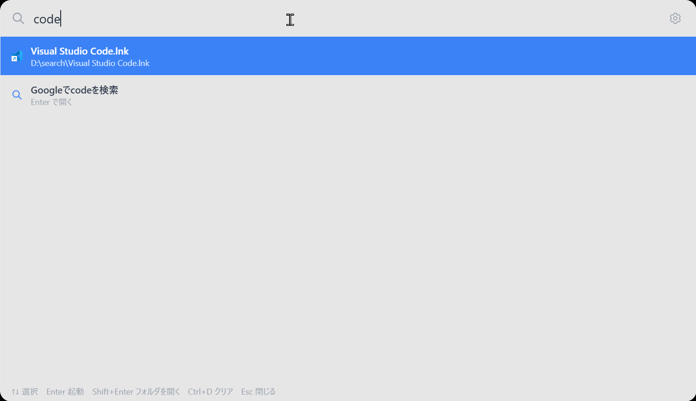
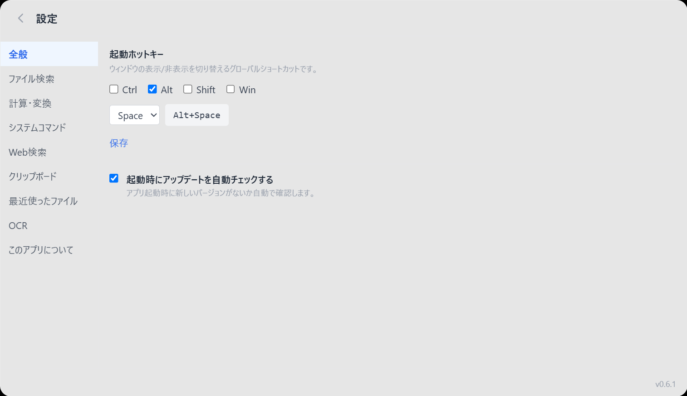
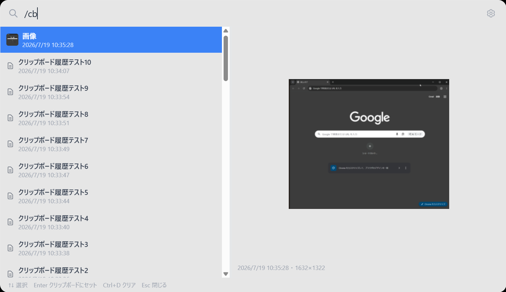
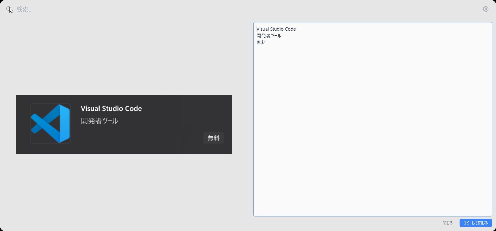

# WinLauncher

A fast, keyboard-driven launcher for Windows 11 — built with Tauri v2, React, and Rust.

For a detailed introduction and screenshots, visit the [introduction site](https://hidecode365.github.io/win-launcher-site/).



## Screenshots

| File Search | Settings | Clipboard History | OCR |
| ------------- | ---------- | ------------------ | ---- |
|  |  |  |  |

## Features

- **File Search** — Incremental search across configured folders with frecency-based ranking
- **Pinned Files** — Keep frequently used files at the top of the result list
- **Favorites** — Organize files into a folder tree and recall them with `/favorite`
- **Memos** — Organize and edit text notes in a folder tree, then recall them with `/memo`
- **Recent Files** — Browse recently opened files with `/recent`
- **Calculator** — Type expressions like `1000 + 200` for instant results
- **Clipboard History** — Browse and restore text & image history with `/cb`
- **OCR (Image to Text)** — Paste an image (`Ctrl+V`) into the search box to extract text via Windows OCR, with mixed Japanese/English support
- **Web Search** — Search Google directly from the launcher
- **System Commands** — Shutdown, restart, or sleep with confirmation
- **Customizable Hotkey** — Default `Alt+Space`, configurable from settings
- **System Tray** — Runs silently in the background
- **Auto-Update** — Checks for new versions on startup (configurable) or on demand via the tray menu

## Installation

Download the installer from [Releases](https://github.com/hidecode365/win-launcher/releases).

```bash
winget install hidecode365.WinLauncher
```

## Usage

| Key | Action |
| ----- | -------- |
| `Alt+Space` | Open / close launcher |
| `↑↓` | Navigate results |
| `Enter` | Launch / execute |
| `Esc` | Close |
| `Ctrl+,` | Open settings |
| `/cb` | Open clipboard history |
| `/recent` | Browse recently opened files |
| `/favorite` | Browse favorites |
| `/memo` | Browse and edit memos |
| `Ctrl+V` (with image) | Extract text from clipboard image via OCR |

## Security Note

Clipboard text history is stored **unencrypted** in plain text on disk. Avoid copying sensitive information (passwords, tokens, etc.) while clipboard history is enabled, or disable the feature from settings if this is a concern.

## Requirements

- Windows 11 (x64)
- No additional runtime required

## Tech Stack

- [Tauri v2](https://tauri.app/)
- React + TypeScript
- Rust
- Tailwind CSS

## Feedback

Please report bugs and feature requests via [GitHub Issues](https://github.com/hidecode365/win-launcher/issues).

## License

MIT
